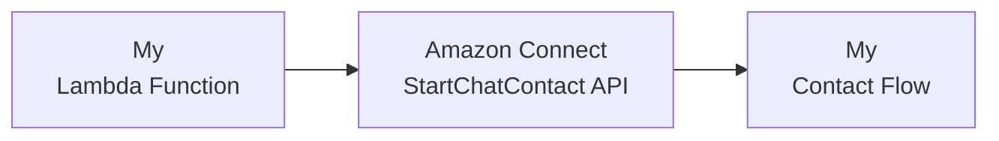
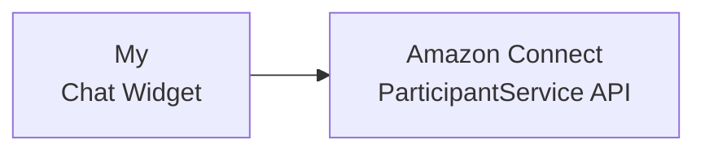

# Amazon Connect Chat Starter API Calls

Bares bone API calls to create and connect to an Amazon Connect Chat session

1. Start a new chat using the [StartChatContact](https://docs.aws.amazon.com/connect/latest/APIReference/API_StartChatContact.html) API (which requires [Sig v4](https://docs.aws.amazon.com/IAM/latest/UserGuide/reference_aws-signing.html) authentication)



```js
// Example lambda code for StartChatContact request
process.env.CONTACT_FLOW_ID = '<REPLACE_ME'; // https://docs.aws.amazon.com/connect/latest/adminguide/find-contact-flow-id.html
process.env.INSTANCE_ID = '<REPLACE_ME'; // https://docs.aws.amazon.com/connect/latest/adminguide/find-instance-arn.html

const { SdkClient, StartChatContactCommand, ConnectClient } = require("@aws-sdk/client-connect"); // v3.470.0

exports.handler = async (event, context) => {
    // Initialize the Connect client
    const client = new ConnectClient({ region: process.env.AWS_REGION });

    // Create the StartChatContact command
    const command = new StartChatContactCommand({
      ContactFlowId: process.env.CONTACT_FLOW_ID, // Replace with your actual Contact Flow ID
      InstanceId: process.env.INSTANCE_ID, // Replace with your actual Instance ID
      Attributes: {
        // Add any additional attributes to be passed to the Contact Flow
      },
    });

    // Send the command and wait for the response
    const response = await client.send(command);

    console.log("StartChatContact successful", response);

    return {
      statusCode: 200,
      body: {
         "ContactId": response.ContactId,
         "ParticipantId": response.ParticipantId,
         "ParticipantToken": response.ParticipantToken
      },
    };
};
```

2. Connect to the chat session using the [ParticipantService](https://docs.aws.amazon.com/connect-participant/latest/APIReference/API_Operations.html) public APIs



```js
// Example browser code for AmazonConnectParticipantService requests

import "amazon-connect-chatjs"; // v2.2.0

const customerChatSession = connect.ChatSession.create({
  chatDetails: {
    contactId: "...", // REQUIRED
    participantId: "...", // REQUIRED
    participantToken: "...", // REQUIRED
  },
  options: {
    region: process.env.AWS_REGION,
  },
  type: "CUSTOMER", // REQUIRED
});

await chatSession.connect();

// Retrieve the chat transcript
const awsSdkResponse = await chatSession.getTranscript({
  maxResults: 100,
  sortOrder: "ASCENDING"
});
const { InitialContactId, NextToken, Transcript } = awsSdkResponse.data;

// Send a message to the chat
const awsSdkResponse = await chatSession.sendMessage({
  contentType: "text/plain",
  message: "Hello World!"
});
const { AbsoluteTime, Id } = awsSdkResponse.data;
```
